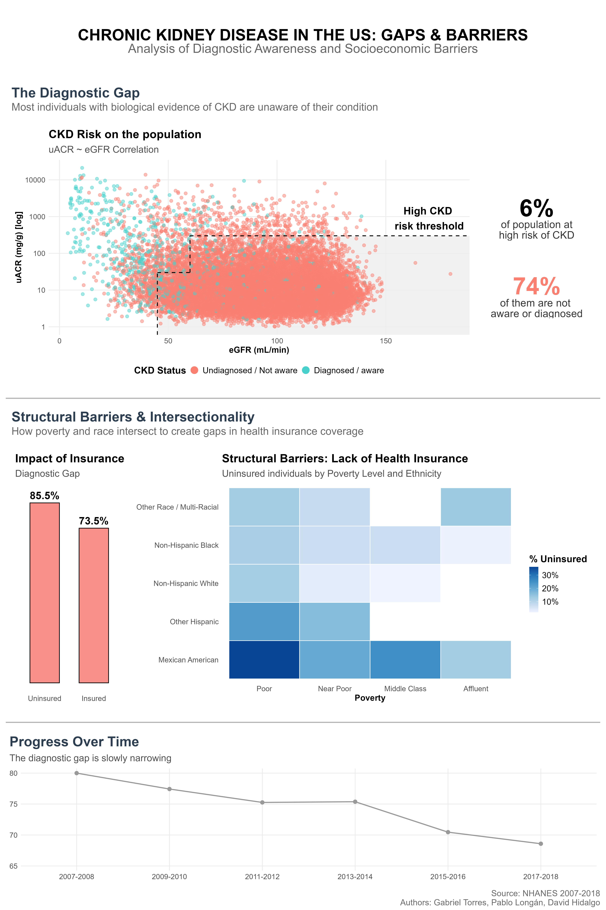

# Chronic Kidney Disease Diagnostic Gap in the US (NHANES 2007–2018)

Analysis of the gap between biological evidence of Chronic Kidney Disease (CKD) and
physician-diagnosed / self-reported awareness, across six NHANES survey cycles
(2007–2018, ~10 years) in the U.S. adult population.

Team project for the **Health Data Visualization** course, MSc in Health Data Science (URV).
Authors: Gabriel Torres, Pablo Longán, David Hidalgo Fàbregas.

## Motivation

CKD is often asymptomatic in its early stages, and a large share of at-risk individuals
are never diagnosed until the disease has progressed. This project quantifies that
diagnostic gap in a nationally representative U.S. sample and investigates which
socioeconomic and demographic factors are associated with it.

## Data

U.S. National Health and Nutrition Examination Survey (NHANES), six two-year cycles,
under `dataset/<cycle>/`:

| Cycle | Files used |
|---|---|
| 2007–2008 | `DEMO_E`, `BIOPRO_E`, `ALB_CR_E`, `HIQ_E`, `KIQ_U_E` |
| 2009–2010 | `DEMO_F`, `BIOPRO_F`, `ALB_CR_F`, `HIQ_F`, `KIQ_U_F` |
| 2011–2012 | `DEMO_G`, `BIOPRO_G`, `ALB_CR_G`, `HIQ_G`, `KIQ_U_G` |
| 2013–2014 | `DEMO_H`, `BIOPRO_H`, `ALB_CR_H`, `HIQ_H`, `KIQ_U_H` |
| 2015–2016 | `DEMO_I`, `BIOPRO_I`, `ALB_CR_I`, `HIQ_I`, `KIQ_U_I` |
| 2017–2018 | `DEMO_J`, `BIOPRO_J`, `ALB_CR_J`, `HIQ_J`, `KIQ_U_J` |

Datasets: Demographics (`DEMO`), Standard Biochemistry Profile (`BIOPRO`), Albumin &
Creatinine — Urine (`ALB_CR`), Health Insurance (`HIQ`), and Kidney Conditions —
Urology questionnaire (`KIQ_U`).

## Pipeline

This project runs as a **two-stage, two-language pipeline**:

1. **Exploratory analysis (Python)** — `exploratory_analysis/exploratory.ipynb`
   Loads and harmonizes the 6 NHANES cycles, derives eGFR (CKD-EPI) and urine
   albumin-to-creatinine ratio (uACR), stages CKD risk per **KDIGO guideline**
   thresholds into a binary high-risk biomarker, and runs the statistical testing
   (`pandas`, `scipy.stats`: chi-square tests and odds ratios across insurance status,
   poverty-income ratio, education, and race/ethnicity). Exports the processed cohort
   to `exploratory_analysis/df_processed.csv`.
2. **Explanatory analysis (R / Quarto)** — `explanatory_analysis/explanatory.qmd`
   Reads `df_processed.csv` and builds the final explanatory infographic with a
   custom `ggplot2` theme and `patchwork` panel layout, designed for a non-technical,
   health-administrator audience.

## Key findings

- ~**6%** of the sampled population is at high biological risk of CKD.
- ~**74%** of those high-risk individuals are undiagnosed or unaware of their condition.
- **Lack of health insurance** was the only factor with a statistically significant
  association with the diagnostic gap (chi-square / odds ratio testing); poverty level
  and race/ethnicity showed a compounding, intersectional pattern in insurance coverage.
- The diagnostic gap has **narrowed slowly** over the 2007–2018 period but remains large.



## Repository structure

```
.
├── dataset/                          # Raw NHANES .xpt files, by cycle
│   └── <cycle>/*.xpt
├── exploratory_analysis/
│   ├── exploratory.ipynb             # Python: cleaning, biomarker derivation, stats
│   ├── exploratory.html              # Rendered, read-only export
│   └── df_processed.csv              # Handoff file consumed by the R stage
├── explanatory_analysis/
│   ├── explanatory.qmd               # R/Quarto: final infographic (tidyverse, patchwork)
│   ├── explanatory.html              # Rendered Quarto output
│   └── explanatory_files/            # Individual panel renders
├── infography/
│   ├── Final_Infography.png          # Combined final infographic
│   └── panel*.png                    # Individual panels
├── Abstract.qmd / Abstract.html      # Project abstract / summary write-up
└── README.md
```

## Reproducing the analysis

```bash
# 1. Python stage
pip install pandas numpy scipy jupyter
jupyter nbconvert --to notebook --execute exploratory_analysis/exploratory.ipynb

# 2. R / Quarto stage (requires Quarto CLI: https://quarto.org)
# install.packages(c("tidyverse", "patchwork"))
quarto render explanatory_analysis/explanatory.qmd
```

## Tech stack

**Python** (exploratory analysis): pandas · NumPy · scipy.stats · Jupyter
**R** (explanatory analysis): Quarto · tidyverse (ggplot2, dplyr) · patchwork

## Data source & license

Data: NHANES, National Center for Health Statistics (NCHS), CDC — public-use,
de-identified survey microdata.
